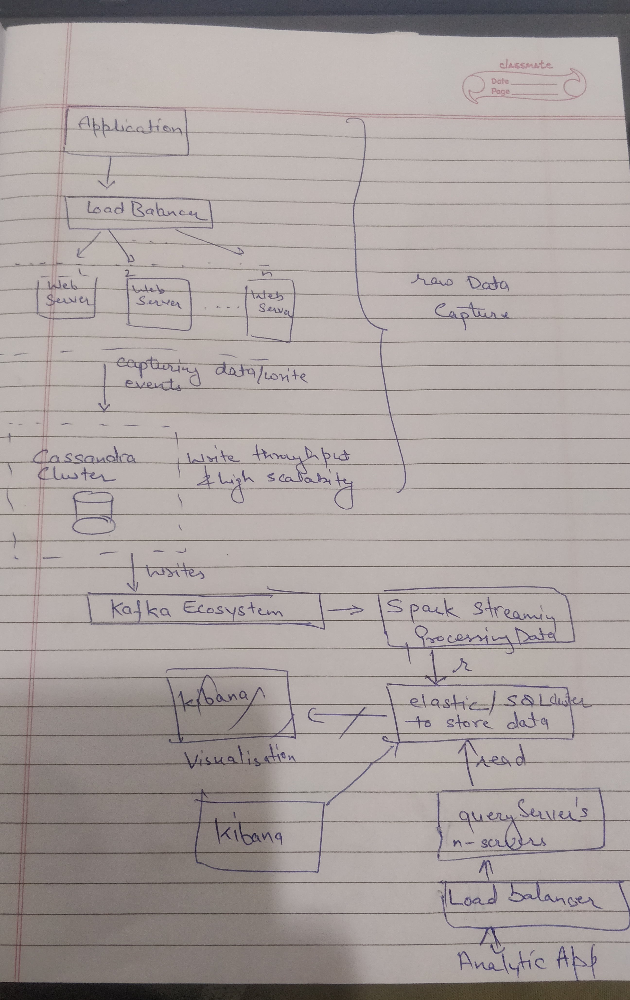

# paypayExercise
Design Question: Design A Google Analytic like Backend System. We need to provide Google Analytic like services to our customers. Pls provide a high level solution design for the backend system. Feel free to choose any open source tools as you want.

The system needs to:

handle large write volume: Billions write events per day.

handle large read/query volume: Millions merchants want to get insight about their business. Read/Query patterns are time-series related metrics.

provide metrics to customers with at most one hour delay.

run with minimum downtime.

have the ability to reprocess historical data in case of bugs in the processing logic.

### Solution

1. Application is triggering events that are recieved by load balancer based on the load it share it to n - web server to capture those events(we could also use AWS lamda's event collection).

2. Then the captured data is being written to Cassandra cluster. Purpose for choosing cassandra for writing the dat is because it's 9:1 write to read throughput.

3. From cassandra we write data to kafka to divide the read of data processing of data as parallel and fault tolerance with the help kafka and Spark for further processing of data into informative form.

4. Beyond depending on application use case we either write data elastic storage and then view analytics using kibana or other tools.

5. Else we write it database and then perform read operation from other application with n servers and load is divide by load balancer.  